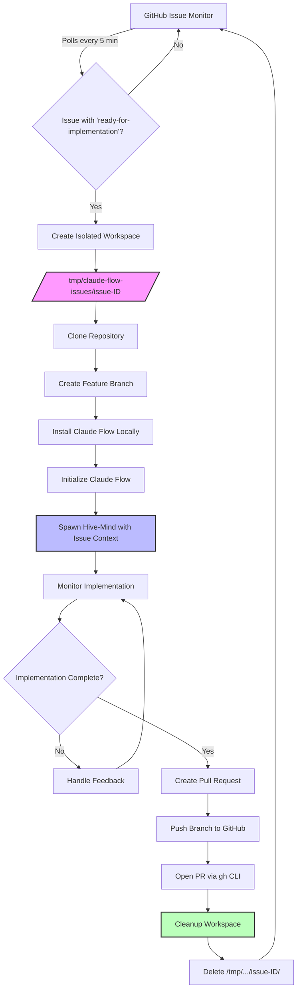

# Epic: Claude Flow Integration

## Overview

Transform CCPM into an autonomous development system by integrating Claude Flow's hive-mind architecture. The implementation creates a systemd background service that monitors GitHub issues and, for each issue, executes a complete isolated workflow: creating a dedicated workspace, checking out a feature branch, installing Claude Flow locally within that workspace, spawning the hive-mind to implement the issue, handling feedback iterations, and creating the final pull request. Each issue gets its own clean, isolated Claude Flow installation to prevent state contamination.

## Architecture Decisions

### Core Design Choices
- **Extend Existing Infrastructure**: Build on top of current `.claude/scripts/pm/` rather than replacing
- **Systemd Service Architecture**: Lightweight daemon for continuous issue monitoring
- **Stateful Agent Orchestration**: JSON-based state management for workflow persistence
- **GitHub-First Integration**: All operations through authenticated `gh` CLI commands
- **Docker-Only Development**: All code execution happens in containers for isolation

### Technology Stack
- **Service Layer**: Python-based systemd service with asyncio for concurrent processing
- **State Management**: Local JSON files in `.claude/state/` plus Claude Flow's `.swarm/memory.db`
- **Agent Framework**: Claude Flow v2.0.0 Alpha with hive-mind swarm intelligence
- **Hive-Mind Command**: `npx claude-flow@alpha hive-mind spawn "work on issue #X" --claude`
- **Testing**: Existing Playwright MCP for UI tests, pytest for backend
- **Database**: MongoDB with Prisma ORM (when needed by issues)

### Design Patterns
- **Command Pattern**: Each agent action as discrete, reversible commands
- **Observer Pattern**: GitHub webhook simulation through polling
- **Strategy Pattern**: Dynamic agent selection based on issue requirements
- **Circuit Breaker**: API rate limit protection and failure recovery

## Technical Approach

### Service Components
1. **Issue Monitor** (`claude-flow-service.py`)
   - Polls GitHub every 5 minutes using `gh issue list`
   - Filters by "ready-for-implementation" label
   - Maintains processing queue in `.claude/state/queue.json`
   - Triggers complete per-issue workflow execution

2. **Per-Issue Workflow Orchestrator**
   - Creates isolated workspace: `/tmp/claude-flow-issues/issue-{id}/`
   - Clones repository and creates feature branch: `feature/issue-{id}`
   - Installs Claude Flow locally: `npm install claude-flow@alpha`
   - Spawns hive-mind: `npx claude-flow@alpha hive-mind spawn "implement issue #{id}: {title}" --claude`
   - Monitors execution and captures output
   - Handles feedback loops and iterations
   - Creates PR when implementation complete
   - Cleans up workspace after PR creation

3. **Claude Flow Lifecycle Manager**
   - Per-issue installation (not global)
   - Workspace isolation ensures clean state
   - No .swarm fragmentation (contained in issue workspace)
   - Complete cleanup after PR creation

4. **Agent Personas** (`.claude/agent-personas/`)
   - Leverage existing persona generation system
   - Six specialized agents with clear handoff protocols
   - Integrated into Claude Flow's swarm intelligence

### State Management
- **Issue State**: Track progress per issue in `.claude/state/issues/{issue-id}.json`
- **Agent State**: Preserve context between agent invocations
- **Recovery State**: Checkpoint system for failure recovery
- **Queue State**: Priority queue for issue processing

### Integration Points
- **GitHub API**: Via existing `gh` CLI authentication
- **Claude Flow MCPs**: Direct integration through MCP protocol
- **Docker**: Use existing Docker configurations
- **PM Scripts**: Extend current bash scripts for new workflows

## Implementation Strategy

### Phase 1: Minimal Viable Service (Week 1)
- Basic systemd service that monitors issues
- Simple state management system
- Integration with existing PM scripts
- Single agent (Workflow Architect) implementation

### Phase 2: Multi-Agent Orchestration (Week 2)
- Add remaining agent personas
- Implement agent handoff protocol
- State persistence and recovery
- Error handling and logging

### Phase 3: Full Automation (Week 3)
- PR creation workflow
- Test execution in Docker
- Issue status updates
- Performance optimization

## Task Breakdown Preview

Expanded to 10 essential tasks to properly integrate Claude Flow:

- [ ] **Claude Flow Setup**: Install and configure Claude Flow with MCPs
- [ ] **Service Foundation**: Create systemd service with GitHub polling
- [ ] **State Management**: Implement JSON-based workflow state tracking
- [ ] **Agent Personas**: Generate specialized agents using existing persona system
- [ ] **Orchestrator Core**: Build Claude Flow hive-mind integration
- [ ] **GitHub Integration**: Extend PM scripts for autonomous PR creation
- [ ] **Docker Workflow**: Configure containerized execution environment
- [ ] **Test Automation**: Integrate Playwright MCP for test execution
- [ ] **Monitoring Setup**: Add logging, health checks, and status reporting
- [ ] **Cleanup & Gitignore**: Configure state cleanup and repository hygiene

## Dependencies

### Prerequisites
- Authenticated GitHub CLI (`gh`)
- Claude Flow MCPs installed and configured
- Docker running locally
- Python 3.9+ for service implementation
- Systemd (Linux/macOS)

### External Services
- GitHub API (5000 req/hour limit)
- Claude API (rate limits apply)
- Docker Hub for base images

### Internal Components
- CCPM base system must be initialized
- `.claude/scripts/pm/` scripts operational
- Agent persona generation system ready

## Success Criteria (Technical)

### Performance Benchmarks
- Issue detection latency < 30 seconds
- Simple issue completion < 30 minutes
- Memory usage < 500MB per issue
- Concurrent processing of 3 issues

### Quality Gates
- All PRs include tests (>90% coverage)
- No failed Docker builds
- Clean `gh pr checks` before completion
- State recovery success rate > 95%

### Acceptance Criteria
- Service runs continuously without intervention
- PRs created match issue requirements
- Comprehensive logging for debugging
- Graceful degradation on failures

## Workflow Architecture Diagram



## Claude Flow Implementation Notes

### Per-Issue Workflow Commands
```bash
# 1. Create isolated workspace
mkdir -p /tmp/claude-flow-issues/issue-{id}
cd /tmp/claude-flow-issues/issue-{id}

# 2. Clone and branch
git clone {repo_url} .
git checkout -b feature/issue-{id}

# 3. Install Claude Flow locally
npm init -y
npm install claude-flow@alpha
npx claude-flow init --force

# 4. Execute implementation
npx claude-flow@alpha hive-mind spawn "implement issue #{id}: {description}" --claude

# 5. Create PR
git add -A
git commit -m "feat: implement issue #{id}"
git push origin feature/issue-{id}
gh pr create --title "Fix #{id}: {title}" --body "{implementation_summary}"

# 6. Cleanup
cd /
rm -rf /tmp/claude-flow-issues/issue-{id}
```

### Known Issues to Address
1. **Fragmented Memory**: .swarm directories can be created in multiple locations
2. **State Persistence**: Must ensure single .swarm location at project root
3. **Cleanup Required**: State must be cleared between issues to prevent contamination
4. **Gitignore Essential**: .swarm/ and related files must never be committed

### Integration Strategy
- Each issue gets isolated workspace with local Claude Flow installation
- Complete workflow per issue: workspace → branch → install → implement → PR → cleanup
- No global Claude Flow installation required
- State naturally isolated by workspace separation
- Clean environment for each issue prevents contamination

## Estimated Effort

### Timeline
- **Total Duration**: 3-4 weeks (adjusted for Claude Flow integration)
- **Phase 1**: 7 days (Claude Flow setup + service foundation)
- **Phase 2**: 7 days (multi-agent system)
- **Phase 3**: 5 days (automation & polish)

### Resource Requirements
- 1 senior engineer for service architecture
- Claude API credits for agent execution
- Local development machine with 8GB RAM
- GitHub repository access

### Critical Path
1. Claude Flow installation (blocks everything)
2. Systemd service setup (blocks automation)
3. State management (blocks orchestration)
4. Agent persona generation (blocks automation)
5. GitHub integration (blocks PR creation)

## Tasks Created
- [ ] #18 - Per-Issue Workflow Template & Claude Flow Integration (parallel: false)
- [ ] #6 - Service Foundation - Create systemd service with GitHub polling (parallel: false)
- [ ] #9 - State Management - Implement JSON-based workflow state tracking (parallel: true)
- [ ] #11 - Agent Personas - Generate specialized agents using existing persona system (parallel: true)
- [ ] #2 - Orchestrator Core - Build agent coordination and handoff logic (parallel: false)
- [ ] #5 - GitHub Integration - Extend PM scripts for autonomous PR creation (parallel: false)
- [ ] #10 - Docker Workflow - Configure containerized execution environment (parallel: true)
- [ ] #4 - Test Automation - Integrate Playwright MCP for test execution (parallel: false)
- [ ] #7 - Monitoring Setup - Add logging, health checks, and status reporting (parallel: false)
- [ ] #8 - Gitignore & State Cleanup Configuration (parallel: false)

Total tasks: 10
Parallel tasks: 3
Sequential tasks: 7
Estimated total effort: 114 hours
